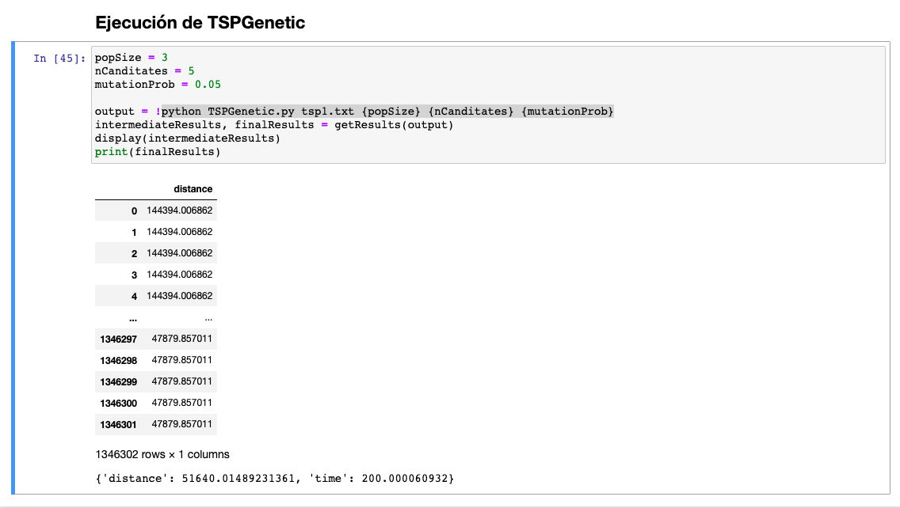

# Base para ejecutar los algoritmos

Se modificaron los algoritmos TSPGrasp y TSPGenetic para que acepten algunos parámetros

| Algoritmo  | Parámetros                       | Comando                                                              | Ejemplo                                  |   |
|------------|----------------------------------|----------------------------------------------------------------------|------------------------------------------|---|
| TSPGraps   | rcl                              | python TSPGrasp.py tsp1.txt {rcl}                                    | python TSPGrasp.py tsp1.txt 3            |   |
| TSPGenetic | popSize nCanditates mutationProb | python TSPGenetic.py tsp1.txt {popSize} {nCanditates} {mutationProb} | python TSPGenetic.py tsp1.txt 100 5 0.05 |   |

Se agregó una función auxiliar llamada getResults, que extrae las salidas de los algoritmos, retornando un dataframe con los resultados intermedios y un diccionario con los resultados finalnes

